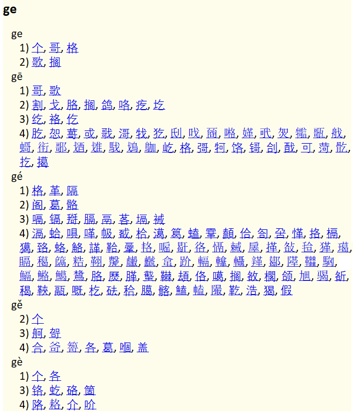

# Chinese Phonetic Index

## Introduction

This is a dictionary matching Mandarin Chinese pinyin syllables to simplified characters that may have the corresponding reading. The characters are sorted according to their frequency and split into 4 groups:

1) Majority characters are the most frequent characters comprising 95% of the corpus.
2) Minority characters are the most frequent characters comprising 99.8% of the corpus except the majority characters.
3) Rare characters are the least frequent characters comprising 0.02% of the corpus.
4) Uncommon characters are those present in the Unicode database, but not observed in the corpus.

Here is an example dictionary entry for "ge":



If a character has several readings, I try to estimate the frequency for each reading separately. This is the reason why you can see the same character in different groups in the entry above. But this estimate may be inaccurate, because frequency data for different readings is very limited in available data bases.

## Download & Install

The main artifact of the project is a DSL dictionary you can add to [GoldenDict](http://goldendict.org/) or a similar dictionary manager. Copy [ChPhoneticIndex.ann](output/ChPhoneticIndex.ann), [ChPhoneticIndex.bmp](output/ChPhoneticIndex.bmp), and [ChPhoneticIndex.dsl](output/ChPhoneticIndex.dsl) into your custom dictionary folder, add it to your favorite dictionary manager and enjoy.

## Additional Artifacts

Here you can look at the result represented as a table [sorted by frequency](output/FrequencyTable.md) or [sorted by pinyin](output/PinyinTable.md). Here is also some [database statistics](output/Statistics.md).

The entropy value characterizes the uncertainty in the graphical representation of a given pinyin syllable (uncommon characters excluded). Entropy of 0 means it can be written using only one character, larger values mean more options available. If a syllable can be represented by *n* characters, its entropy will be maximized if all the characters have the same frequency (the uniform distribution). Here is a reference table for this case:

| n   | Entropy of the uniform distribution |
|----:|:------------------------------------|
|   1 | 0.000                               |
|   2 | 0.693                               |
|   3 | 1.099                               |
|   4 | 1.386                               |
|   5 | 1.609                               |
|   6 | 1.792                               |
|   7 | 1.946                               |
|   8 | 2.079                               |
|   9 | 2.197                               |
|  10 | 2.303                               |
|  11 | 2.398                               |
|  12 | 2.485                               |
|  13 | 2.565                               |
|  14 | 2.639                               |

## Algorithm

Input data:

* [Unicode Han Database](https://unicode.org/Public/UNIDATA/Unihan.zip): Unihan_Readings and Unihan_Variants tables.
* Jun Da [Character frequency list of Modern Chinese](https://lingua.mtsu.edu/chinese-computing/statistics/char/list.php?Which=MO).

1. All the tables are merged into a single one, frequency numbers of Jun Da and HanyuPinlu are added together.
2. Leave only HanyuPinlu, HanyuPinyin, Mandarin, TGHZ2013, and XHC1983 fields from Unihan_Readings.
2. Traditional characters fully replaced by simplified forms are filtered out.
3. Estimate a frequency for each (`character`, `pinyin`) pair: if a relative frequency value from HanyuPinlu is available, use it. If `character` is in Jun Da and `pinyin` is in the corresponding Mandarin field, use Jun Da frequency divided by the number of Mandarin readings (usually, there is only one). Otherwise, set frequency to 0.
4. Estimate a rank for each (`character`, `pinyin`) pair: for each Unihan_Readings field find the `pinyin` index, inverse it and sum the results. E.g. for 啁 HanyuPinyin is "zhāo dāo zhōu tiáo diào", Mandarin is "zhāo", both XHC1983 and TGHZ2013 are "zhāo zhōu". Than zhāo rank is 1/1 * 4 = 4, dāo rank is 1/2 = 0.5, zhōu rank is 1/3 + 1/2 * 2 = 1.333, etc.
5. Calculate cumulative frequency and split (`character`, `pinyin`) pairs into 4 groups. Within each group sort by (frequency, rank).
6. Generate the output.

## Information for Developers

If you want to reproduce the results, you need Python 3.10 or newer with installed [requirements](requirements.txt), CMake 3.18 or newer and some CMake-compatible make. Launch it in a regular way, e.g.:

```
cmake -S ChinesePhoneticIndex -B ChinesePhoneticIndex/build
cmake --build ChinesePhoneticIndex/build
```

If you want to commit the output, pass `-DRELEASE_BUILD` in the configuration step.
